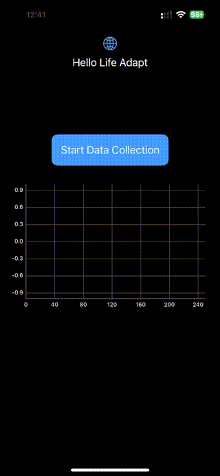

# Life Adapt ios test app

## Flow

- The app starts by displaying a button "Start Data Collection" and an empty chart
- Once the button is clicked, for 5 seconds the app will collect accelerometer data
- Then after 5 seconds the app will send the data to `https://jadjp86fqj.execute-api.us-east-1.amazonaws.com/staging/accelerometer` endpoint created via amplify
- This public endpoint is having a python lambda behind which can be found [here](amplify/backend/function/lifeadaptbackendf511c7e2/src/index.py). 
- This lambda returns the content that has been sent. The app will then plot the data in a chart from this response.
- Click on Stop Data Collection to stop the collection and calls.

## Build

Run `pod install` to install dependencies (for charts mostly)

## Run

Open `life-adapt-ios.xcworkspace` in XCode and run the app from there on your device (accelerometer data collection requires a physical device, doesn't work with simulators)

## Archive

You may use the archive [here](<life-adapt-ios 3-23-24, 02.01.xcarchive>)