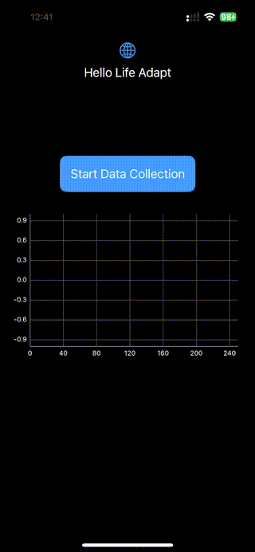

# Life Adapt ios test app

## Flow

- The app starts by displaying [a button "Start Data Collection" and an empty chart](life-adapt-ios/ContentView.swift)
- Once the button is clicked, for 5 seconds [the app will collect accelerometer data](life-adapt-ios/ViewController.swift#L31) (it is being executed in the main thread but could be done in background)
- Then after 5 seconds [the app will send the data](life-adapt-ios/ViewController.swift#L63) to `https://jadjp86fqj.execute-api.us-east-1.amazonaws.com/staging/accelerometer` endpoint created via AWS Amplify (This AWS Amplify backend has been generated via the Amplify CLI which pushed different AWS resources such as API Gateway, Lambda resource and all the related AWS Permissions)
- This public endpoint is having a python lambda behind which can be found [here](amplify/backend/function/lifeadaptbackendf511c7e2/src/index.py). (Auth is not implemented but could be easily added)
- This lambda returns the content that has been sent. The app will then plot the data in a chart from this response.
- Click on Stop Data Collection to stop the collection and calls.

## Build

- Run `sudo gem install cocoapods` to install pod
- Run `pod install` to install dependencies (for charts mostly)

## Run

Open `life-adapt-ios.xcworkspace` in XCode and run the app from there on your device (accelerometer data collection requires a physical device, doesn't work with simulators)

## Test

There is one [small test to be executed](life-adapt-iosTests/ViewControllerTests.swift)

## Archive

You may use the archive [here](archive.xcarchive)